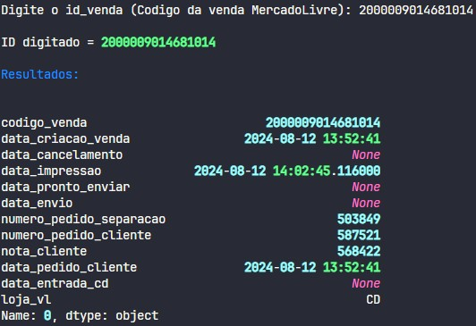

# check_ml_label

Metodo para verificar status de uma venda do MercadoLivre, com base as operacoes de Ecommerce. Projeto voltado para empresa KAIZEN AUTO PECAS.

## Funcionalidades

1. [X] Consulta no banco de dados.
2. [X] Filtro de dados, com base a um ID de venda.
3. [X] Apresentacao dos dados.



## Uso

1. Baixe o repositorio do projeto

```bash
git clone https://github.com/jef-loppes-reis/check_ml_label
```

2. Depedencias

```bash
py -m venv .venv;
.venv/Scripts/activate;
pip install -r ./requirements.txt
```

3. Principal

```bash
py main.py
```
